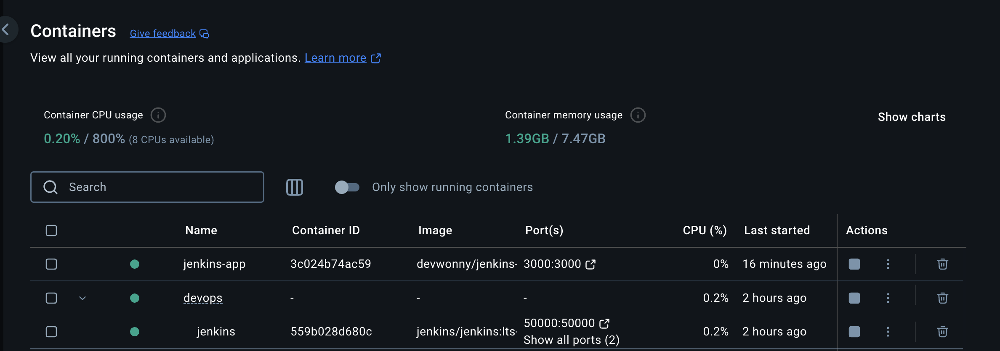
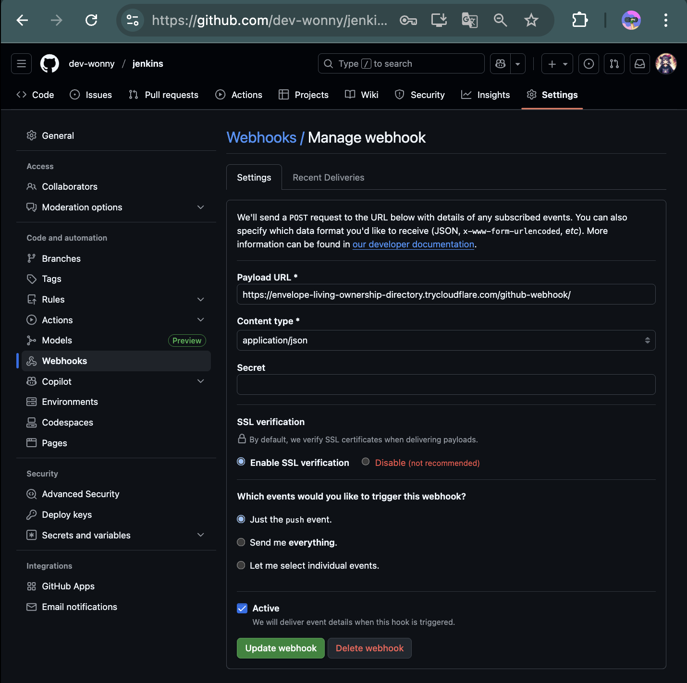
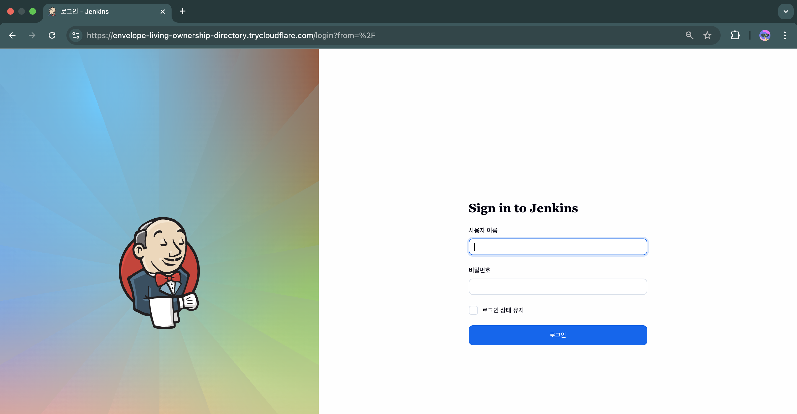
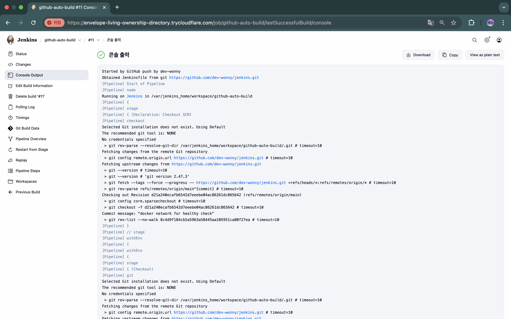
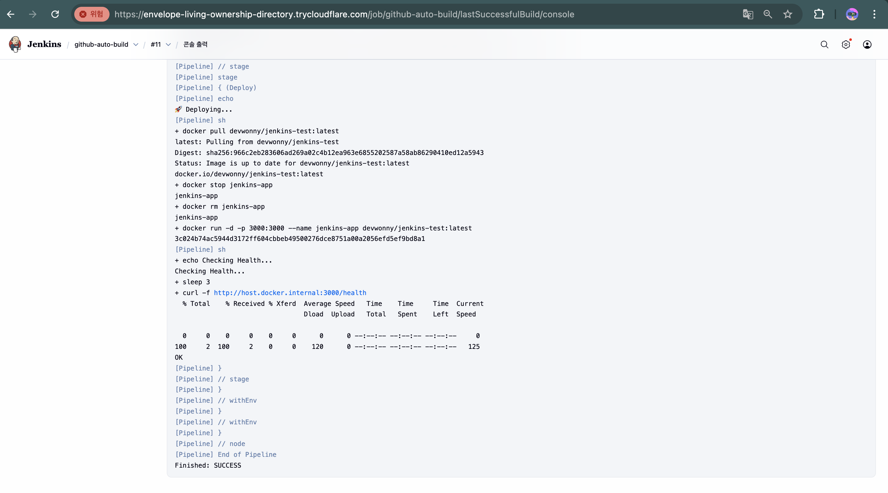
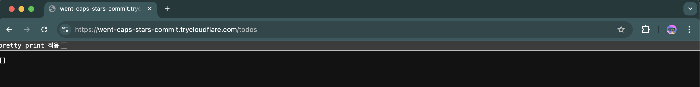

## 전체 흐름 요약 그림
```text
   Push Code
      ▼
┌───────────┐        Build/Test        ┌──────────┐
│  GitHub   │ ───────────────────────► │ Jenkins  │
└───────────┘                          └─────┬────┘
                                             │ docker build
                                             ▼
                                     ┌──────────────┐
                                     │  DockerHub   │
                                     └─────┬────────┘
                                           │ docker pull
                                           ▼
                               ┌────────────────────────────┐
                               │    Local Docker Engine     │
                               │ (jenkins-app container)    │
                               └───────────┬────────────────┘
                                           ▼
                                 Health Check (OK)

```

## 전체 CI/CD 흐름 구조도
```text
┌─────────────────────────┐              ┌────────────────────────┐
│        GitHub           │              │        DockerHub        │
│  (소스코드 / Jenkinsfile) │              │ (이미지 저장소 Registry).   │
└─────────────┬───────────┘              └──────────────┬─────────┘
              │                                          ▲
              │ Webhook (Push)                           │ docker push
              ▼                                          │
┌─────────────────────────┐              ┌───────────────┴────────┐
│         Jenkins         │ docker build │    Deployment Server    │
│ (CI/CD Pipeline Engine) ├──────────────►   (로컬 Docker Engine)  │
└─────────────┬───────────┘              └─────────────────────────┘
              │
              │ docker run
              ▼
┌──────────────────────────────┐
│  Local Docker Runtime (Mac)  │
│  - jenkins-app 컨테이너 실행.   │
│  - health check 수행          │
└──────────────────────────────┘

```

## 단계별 상세 설명
### 1. 개발자가 GitHub에 push
- main 브랜치에 push → GitHub webhook 발생
- Jenkins 서버가 자동으로 Pull 이벤트 감지

### 2. Jenkins Pipeline 시작
- Checkout Github repository
- Build Docker Image
- Login DockerHub
- Push Image to DockerHub
- Deploy
   - Jenkins 서버는 Docker가 설치된 맥북 로컬 도커 엔진을 사용함.
- health check
   - curl -f http://host.docker.internal:3000/health

## 실행 화면 캡쳐





```text
Started by GitHub push by dev-wonny
Obtained Jenkinsfile from git https://github.com/dev-wonny/jenkins.git
[Pipeline] Start of Pipeline
[Pipeline] node
Running on Jenkins
 in /var/jenkins_home/workspace/github-auto-build
[Pipeline] {
[Pipeline] stage
[Pipeline] { (Declarative: Checkout SCM)
[Pipeline] checkout
Selected Git installation does not exist. Using Default
The recommended git tool is: NONE
No credentials specified
 > git rev-parse --resolve-git-dir /var/jenkins_home/workspace/github-auto-build/.git # timeout=10
Fetching changes from the remote Git repository
 > git config remote.origin.url https://github.com/dev-wonny/jenkins.git # timeout=10
Fetching upstream changes from https://github.com/dev-wonny/jenkins.git
 > git --version # timeout=10
 > git --version # 'git version 2.47.3'
 > git fetch --tags --force --progress -- https://github.com/dev-wonny/jenkins.git +refs/heads/*:refs/remotes/origin/* # timeout=10
 > git rev-parse refs/remotes/origin/main^{commit} # timeout=10
Checking out Revision d21a240ecafb6542d7eeebe04ac86261dc865642 (refs/remotes/origin/main)
 > git config core.sparsecheckout # timeout=10
 > git checkout -f d21a240ecafb6542d7eeebe04ac86261dc865642 # timeout=10
Commit message: "docker network for healthy check"
 > git rev-list --no-walk 8c4d9f184cb5a5963a58445aa105951ca80f27ea # timeout=10
[Pipeline] }
[Pipeline] // stage
[Pipeline] withEnv
[Pipeline] {
[Pipeline] withEnv
[Pipeline] {
[Pipeline] stage
[Pipeline] { (Checkout)
[Pipeline] git
Selected Git installation does not exist. Using Default
The recommended git tool is: NONE
No credentials specified
 > git rev-parse --resolve-git-dir /var/jenkins_home/workspace/github-auto-build/.git # timeout=10
Fetching changes from the remote Git repository
 > git config remote.origin.url https://github.com/dev-wonny/jenkins.git # timeout=10
Fetching upstream changes from https://github.com/dev-wonny/jenkins.git
 > git --version # timeout=10
 > git --version # 'git version 2.47.3'
 > git fetch --tags --force --progress -- https://github.com/dev-wonny/jenkins.git +refs/heads/*:refs/remotes/origin/* # timeout=10
 > git rev-parse refs/remotes/origin/main^{commit} # timeout=10
Checking out Revision d21a240ecafb6542d7eeebe04ac86261dc865642 (refs/remotes/origin/main)
 > git config core.sparsecheckout # timeout=10
 > git checkout -f d21a240ecafb6542d7eeebe04ac86261dc865642 # timeout=10
 > git branch -a -v --no-abbrev # timeout=10
 > git branch -D main # timeout=10
 > git checkout -b main d21a240ecafb6542d7eeebe04ac86261dc865642 # timeout=10
Commit message: "docker network for healthy check"
[Pipeline] }
[Pipeline] // stage
[Pipeline] stage
[Pipeline] { (Build)
[Pipeline] echo
🔨 Building...
[Pipeline] }
[Pipeline] // stage
[Pipeline] stage
[Pipeline] { (Test)
[Pipeline] echo
🧪 Running tests...
[Pipeline] }
[Pipeline] // stage
[Pipeline] stage
[Pipeline] { (Build Docker Image)
[Pipeline] sh
+ docker build -t devwonny/jenkins-test:latest .
#0 building with "default" instance using docker driver

#1 [internal] load build definition from Dockerfile
#1 transferring dockerfile: 150B done
#1 DONE 0.0s

#2 [auth] library/node:pull token for registry-1.docker.io
#2 DONE 0.0s

#3 [internal] load metadata for docker.io/library/node:18
#3 DONE 1.3s

#4 [internal] load .dockerignore
#4 transferring context: 2B done
#4 DONE 0.0s

#5 [1/5] FROM docker.io/library/node:18@sha256:c6ae79e38498325db67193d391e6ec1d224d96c693a8a4d943498556716d3783
#5 DONE 0.0s

#6 [internal] load build context
#6 transferring context: 17.69kB done
#6 DONE 0.0s

#7 [2/5] WORKDIR /app
#7 CACHED

#8 [3/5] COPY package*.json ./
#8 CACHED

#9 [4/5] RUN npm install
#9 CACHED

#10 [5/5] COPY . .
#10 DONE 0.0s

#11 exporting to image
#11 exporting layers 0.0s done
#11 writing image sha256:6f22c62827b417383edc5f234a01a6bb4eb797606b13095e05dd1581d83f5508 done
#11 naming to docker.io/devwonny/jenkins-test:latest done
#11 DONE 0.0s
[Pipeline] }
[Pipeline] // stage
[Pipeline] stage
[Pipeline] { (Login DockerHub)
[Pipeline] withCredentials
Masking supported pattern matches of $DOCKER_PASS
[Pipeline] {
[Pipeline] sh
+ docker login -u devwonny --password-stdin
+ echo ****
WARNING! Your password will be stored unencrypted in /root/.docker/config.json.
Configure a credential helper to remove this warning. See
https://docs.docker.com/engine/reference/commandline/login/#credentials-store

Login Succeeded
[Pipeline] }
[Pipeline] // withCredentials
[Pipeline] }
[Pipeline] // stage
[Pipeline] stage
[Pipeline] { (Push Image to DockerHub)
[Pipeline] sh
+ docker push devwonny/jenkins-test:latest
The push refers to repository [docker.io/devwonny/jenkins-test]
e279e4c5c7d3: Preparing
52c13447f812: Preparing
7486c63ea28c: Preparing
fa71d05ffdaf: Preparing
e78159dbd370: Preparing
a358a725b813: Preparing
cd8a6003174c: Preparing
abb63e49e652: Preparing
6cc65bdde70e: Preparing
41a4e3939504: Preparing
3520c50ae60e: Preparing
75ba6634710f: Preparing
cd8a6003174c: Waiting
abb63e49e652: Waiting
6cc65bdde70e: Waiting
41a4e3939504: Waiting
3520c50ae60e: Waiting
a358a725b813: Waiting
75ba6634710f: Waiting
e78159dbd370: Layer already exists
52c13447f812: Layer already exists
fa71d05ffdaf: Layer already exists
7486c63ea28c: Layer already exists
cd8a6003174c: Layer already exists
a358a725b813: Layer already exists
abb63e49e652: Layer already exists
6cc65bdde70e: Layer already exists
75ba6634710f: Layer already exists
3520c50ae60e: Layer already exists
41a4e3939504: Layer already exists
e279e4c5c7d3: Pushed
latest: digest: sha256:966c2eb283606ad269a02c4b12ea963e6855202587a58ab86290410ed12a5943 size: 2837
[Pipeline] }
[Pipeline] // stage
[Pipeline] stage
[Pipeline] { (Deploy)
[Pipeline] echo
🚀 Deploying...
[Pipeline] sh
+ docker pull devwonny/jenkins-test:latest
latest: Pulling from devwonny/jenkins-test
Digest: sha256:966c2eb283606ad269a02c4b12ea963e6855202587a58ab86290410ed12a5943
Status: Image is up to date for devwonny/jenkins-test:latest
docker.io/devwonny/jenkins-test:latest
+ docker stop jenkins-app
jenkins-app
+ docker rm jenkins-app
jenkins-app
+ docker run -d -p 3000:3000 --name jenkins-app devwonny/jenkins-test:latest
3c024b74ac5944d3172ff604cbbeb49500276dce8751a00a2056efd5ef9bd8a1
[Pipeline] sh
+ echo Checking Health...
Checking Health...
+ sleep 3
+ curl -f http://host.docker.internal:3000/health
  % Total    % Received % Xferd  Average Speed   Time    Time     Time  Current
                                 Dload  Upload   Total   Spent    Left  Speed

  0     0    0     0    0     0      0      0 --:--:-- --:--:-- --:--:--     0
100     2  100     2    0     0    120      0 --:--:-- --:--:-- --:--:--   125
OK
[Pipeline] }
[Pipeline] // stage
[Pipeline] }
[Pipeline] // withEnv
[Pipeline] }
[Pipeline] // withEnv
[Pipeline] }
[Pipeline] // node
[Pipeline] End of Pipeline
Finished: SUCCESS

```


